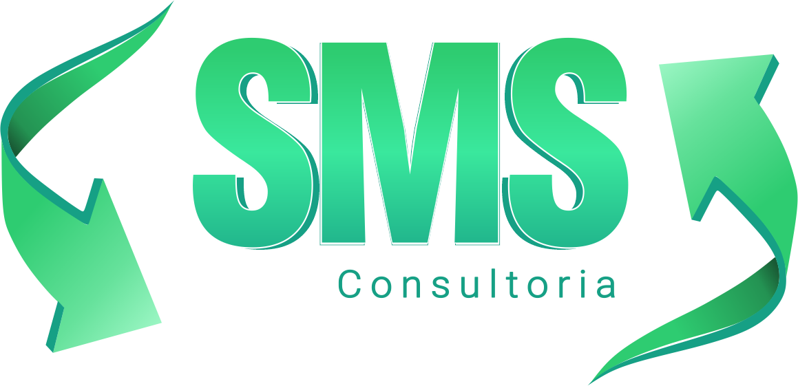

<!-- PROJECT LOGO -->
 

  

  <h3 align="center">SMS Consultoria</h3>

  

    Prestação de serviços - Consultoria, assesoria e treinamentos em saúde, segurança do trabalho e meio ambiente.
     
    <a><strong>Explore a documentação »</strong></a>
     
     
    <a href="https://smsconsultoria.com">Web Site</a>
    ·
    <a href="https://github.com/othneildrew/Best-README-Template/issues">Treinamentos</a>
    ·
    <a href="https://github.com/othneildrew/Best-README-Template/issues">Contato</a>
  

<!-- TABLE OF CONTENTS -->

  
Índice

  <ol>
    <li>
      <a href="#sobre-o-projeto">Sobre o projeto</a>
      <ul>
        <li><a href="#construído-com">Construído com</a></li>
      </ul>
    </li>
    <li><a href="#licença">Licença</a></li>
    <li><a href="#contato">Contato</a></li>
  </ol>

<!-- ABOUT THE PROJECT -->
## Sobre o projeto

[![Product Name Screen Shot][product-screenshot]](https://smsconsultoria.com)

Website desenvolvildo para a empresa que presta serviços de consultoria, e treinamentos de *RACs Riscos de Atividades Criticas e NRs - Normas Regulamentadoras*, entre outros serviços, focado em segurança do trabalho.

Por que ter um site:
* Com um site você tem a vantagem de estar disponível para o seu público durante 24 horas por dia, 7 dias por semana, sem ter os ônus(*obrigação*) de fazer isso presencialmente.

* É ter também um importante canal de vendas sempre aberto para os seus potenciais clientes, seja um site institucional ou uma loja virtual.

* Fortalece a presença online e cria autoridade no mercado.

É claro que esse lista vai mais além, apenas mostrei três motivos. Ter um site é fundamental para o crescimento de sua empresa, além de ter a marca com uma presença digital, você passa mais profissionalismo, confiança e credibilidade para o seu público.

### Construído com

Esté site foi construído com o conceito de SPA - Single Page Application, e uma aplicação web ou site de página única com objetivo de oferecer uma experiência do usuário similar à de um aplicativo desktop.

* [TypeScript](https://www.typescriptlang.org/)
* [NextJS](https://nextjs.org/)
* [React](https://pt-br.reactjs.org/)
* [React Responsive Carousel](https://react-responsive-carousel.js.org/)
* [React Slick](http://react-slick.neostack.com/)
* [React Tabs](https://github.com/reactjs/react-tabs)
* [React Modal](https://github.com/reactjs/react-modal)
* [React Icons](https://react-icons.github.io/react-icons/)
* [Sass](https://sass-lang.com/)
* [NProgress](https://github.com/rstacruz/nprogress)
* [Framer Motion](https://www.framer.com/motion/)
* [@Unform](https://github.com/unform/unform)
* [Prismic](https://prismic.io/)
* [Nodemailer](https://nodemailer.com/)
* [Git Commit Message Linter](https://github.com/legend80s/commit-msg-linter)
* [Dotenv](https://github.com/motdotla/dotenv)

<!-- LICENSE -->
## Licença
 Veja a [Licença](LICENSE.md) para mais informações.

<!-- CONTACT -->
## Contato

Renato Lima - [SMS Consultoria](https://smsconsultoria.com) - sac@smsconsultoria.com

## Autor
<!-- ACKNOWLEDGEMENTS -->

| |
|:---------------------:|
|  [Walleks Miranda](https://github.com/WalleksMR)

Rede sociais:
  - [@twitter](https://twitter.com/WalleksMiranda)

  - [@linkedin](https://www.linkedin.com/in/walleks-r-miranda-b291bb1aa/)

  - [@e-mail]() - walleks@roizmiranda.com.br

<!-- MARKDOWN LINKS & IMAGES -->
<!-- https://www.markdownguide.org/basic-syntax/#reference-style-links -->
[contributors-shield]: https://img.shields.io/github/contributors/othneildrew/Best-README-Template.svg?style=for-the-badge
[contributors-url]: https://github.com/othneildrew/Best-README-Template/graphs/contributors
[forks-shield]: https://img.shields.io/github/forks/othneildrew/Best-README-Template.svg?style=for-the-badge
[forks-url]: https://github.com/othneildrew/Best-README-Template/network/members
[stars-shield]: https://img.shields.io/github/stars/othneildrew/Best-README-Template.svg?style=for-the-badge
[stars-url]: https://github.com/othneildrew/Best-README-Template/stargazers
[issues-shield]: https://img.shields.io/github/issues/othneildrew/Best-README-Template.svg?style=for-the-badge
[issues-url]: https://github.com/othneildrew/Best-README-Template/issues
[license-shield]: https://img.shields.io/github/license/othneildrew/Best-README-Template.svg?style=for-the-badge
[license-url]: https://github.com/othneildrew/Best-README-Template/blob/master/LICENSE.txt
[linkedin-shield]: https://img.shields.io/badge/-LinkedIn-black.svg?style=for-the-badge&logo=linkedin&colorB=555
[linkedin-url]: https://linkedin.com/in/othneildrew
[product-screenshot]: images/screenshot.png
